# vfairness Library Overview

A comprehensive visual guide to the vfairness library for measuring fairness in machine learning models and detecting bias.

> **Availability.** 0.1.0 is prepared and **unreleased**: the repository carries
> no tags and nothing from this codebase has reached PyPI or TestPyPI. The
> `vfairness` name on PyPI currently holds our own early 0.0.1 placeholder that
> exports nothing, so the `pip install` commands in this document describe the
> intended install and do not work yet.
>
> **How the code here was checked (2026-08-28).** The six workflow blocks under
> *Quick Reference* and the two under *Explainability* and *Intersectionality*
> were executed against this working tree, and the outputs shown are the outputs
> they printed. The LLM, agent, multi-agent, XAI-storage and validity-judge
> blocks call out to live external services (an LLM endpoint, Supabase, a judge
> model), so they were **not** executed end to end. For those, every symbol and
> call signature was checked against the installed package, and the assertions
> that do not need a service (`route_explainer(...).primary`, the fail-closed
> `GroundednessScorer().score(...).value is None`) were run and hold.

---

## Library Architecture

vfairness is organized into **15 top-level sub-packages** (a 6-stage fairness pipeline, 8 specialized surfaces, and 1 cross-cutting infrastructure package) covering the full AI fairness pipeline, from traditional ML to LLMs, agents, and multi-agent systems.

The diagram below draws the 6-stage pipeline plus the three agentic surfaces (LLM, agent, multi-agent). The remaining specialized surfaces (XAI, validity, vision, legal, MCP) and the infrastructure package (net) are described in sections 10 to 15 below.

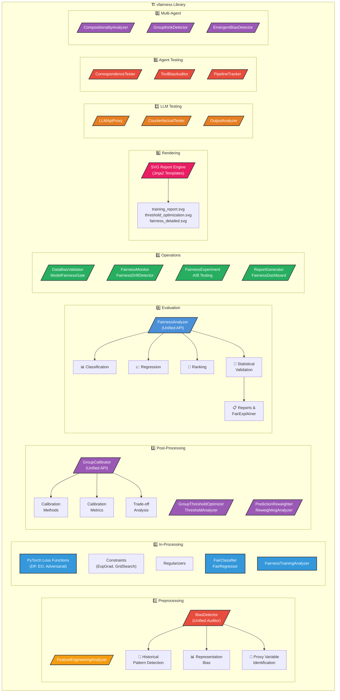

**Module Overview:**

### 1. Preprocessing (`vfairness.preprocessing`)
- **BiasDetector**: Unified auditor for comprehensive bias detection
- **FeatureEngineeringAnalyzer**: Fairness-aware feature transformations
- **Historical Pattern Detection**: 43 curated column-name patterns across US, EU, EU AI Act, and Swiss jurisdictions, plus a structured `attribute_historical_pattern(attribute, domain)` cross-walk that maps documented (race / gender / age / national_origin / religion / disability / geographic-proxy × hiring / lending / healthcare / justice / insurance / education) precedents onto bias findings without keyword-matching evidence text
- **Representation Bias**: Compares dataset demographics to population benchmarks
- **Proxy Variable Identification**: Detects features correlated with protected attributes (univariate), proxy chains (indirect), and **systemic / multivariate leakage**: whether a protected attribute can be reconstructed from all other features together (the "deleting the column is not enough" test)

### 2. In-Processing (`vfairness.in_processing`)
- **FairClassifier / FairRegressor**: Scikit-learn compatible fairness-aware estimators
- **Loss Functions** (PyTorch): DemographicParityLoss, EqualizedOddsLoss, EqualOpportunityLoss, AdversarialDebiasingLoss
- **Constraints**: ExponentiatedGradient (Reductions), GridSearch, ThresholdOptimizer
- **Regularizers**: StatisticalParityRegularizer, HilbertSchmidtRegularizer
- **FairnessTrainingAnalyzer**: Unified analysis and method comparison

### 3. Post-Processing (`vfairness.post_processing`)
- **GroupCalibrator**: Group-specific probability calibration
- **Calibration Methods**: Platt, Isotonic, Beta, Temperature, Histogram
- **GroupThresholdOptimizer**: Group-specific threshold optimization for fairness constraints
- **ThresholdAnalyzer**: Comprehensive threshold sweep analysis
- **PredictionReweighter**: Multiplicative/additive probability adjustment
- **RejectionOptionClassifier**: ROC method for boundary-based corrections
- **ReweightingAnalyzer**: Compare and select best reweighting method

### 4. Evaluation (`vfairness.evaluation`)
- **FairnessAnalyzer**: Single entry point for all fairness computations
- **Metrics**: Classification, Regression, and Ranking fairness metrics
- **Statistical Validation**: Bootstrap CI, Bayesian CI, permutation tests
- **FairExplAIner**: Intelligent metric explanations
- **Visualization**: Professional charts and dashboards

### 5. Operations (`vfairness.operations`)
- **DataBiasValidator**: Data pipeline validation across five dimensions: representation, outcome disparity, missing-value patterns, label quality, and general data hygiene (total-sample adequacy, duplicate rows, zero-variance columns). The hygiene dimension implements the Turing Module 4 "equity as the fourth data-validation dimension" mandate and is the single source of truth consumed by Pulse.
- **ModelFairnessGate**: Deployment gates with thresholds
- **FairnessTestSuite**: pytest integration for CI/CD
- **BiasMonitor**: Continuous monitoring with drift detection (`vfairness.operations.cicd`)

### 6. Rendering (`vfairness.rendering`)
- **render_svg**: Jinja2-based SVG template engine
- **training_report_to_svg**: Training analysis dashboards
- **threshold_optimization_to_svg**: Threshold optimization reports
- **reweighting_comparison_to_svg**: Method comparison charts
- **fairness_detailed_report_to_svg**: Executive-level fairness reports

### 7. LLM Fairness Testing (`vfairness.llm`)

> **What is this?** When you're testing a chatbot, LLM, or any text-generation model for bias, but you don't have access to the training data or model weights, this module lets you probe the model through its API and measure whether it treats different demographic groups fairly.

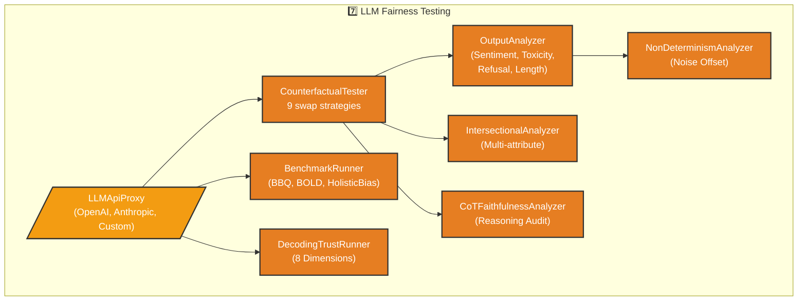

**Key classes:**

| Class | What It Does (Plain English) | When to Use |
|-------|------------------------------|-------------|
| **LLMApiProxy** | Connects to any LLM API (OpenAI, Anthropic, or custom). Sends prompts and collects responses. | First step: set up the connection to the LLM you want to test |
| **CounterfactualTester** | Swaps demographic identifiers in prompts (e.g. "John" to "Jamal") and checks if the LLM responds differently. Uses 9 strategies including Salimian et al.'s metamorphic relations and Cheng et al.'s persona-based testing. | Core test, the #1 way to detect LLM bias |
| **OutputAnalyzer** | Compares LLM responses across groups on 4 dimensions: sentiment, toxicity, refusal rate, and response length. Uses pluggable scorers. | After counterfactual testing: it measures HOW responses differ |
| **BenchmarkRunner** | Runs standardized benchmarks (BBQ for question-answering bias, BOLD for generation bias, HolisticBias for identity-axis descriptor disparity) against your LLM. | When you want comparable scores against published baselines |
| **DecodingTrustRunner** | Runs the DecodingTrust benchmark (Wang et al. 2023, NeurIPS) across 8 trustworthiness dimensions: Stereotype Bias, Fairness, Toxicity, Privacy, Machine Ethics, Adversarial Robustness, OOD Robustness, and Adversarial Demonstrations. Covers 24 demographic groups with 308 built-in prompts and deterministic keyword-based scoring (no LLM-as-judge). | Comprehensive trustworthiness evaluation that goes beyond bias to cover privacy, ethics, and robustness |
| **NonDeterminismAnalyzer** | LLMs give different answers each time. This separates real bias from random noise by running each test 25+ times and computing a "noise floor". | Critical: without this, you can't tell if a disparity is real or just randomness |
| **IntersectionalAnalyzer** | Tests bias at the intersection of multiple attributes (e.g. Black women vs. White men). Applies Bonferroni correction for multiple comparisons. | When single-attribute testing misses compounded discrimination |
| **CoTFaithfulnessAnalyzer** | Tests whether the LLM's chain-of-thought reasoning actually reflects its decision (Turpin et al. 2023 showed it often doesn't). | When you need to audit reasoning, not just outputs |

**Quick start:**

> **Egress guard.** `LLMApiProxy` validates `endpoint_url` through `vfairness.net`
> (the SSRF guard) before any request and pins the connection to the vetted IP, so a
> later DNS change cannot redirect it. Pointing it at a model server on the same
> machine (Ollama, vLLM, a test stub) needs the explicit opt-in
> `LLMApiProxy(..., allow_loopback=True)`; RFC1918, link-local and cloud-metadata
> targets are refused unconditionally and surface as a `ValueError` wrapping
> `SSRFError`.

```python
from vfairness.llm import LLMApiProxy, CounterfactualTester, OutputAnalyzer

# 1. Connect to your LLM
proxy = LLMApiProxy(
    endpoint_url="https://api.openai.com/v1/chat/completions",
    api_format="openai",
    auth_token="sk-...",
    model_name="gpt-4o-mini"
)

# 2. Run counterfactual test (swaps names, runs 25x each)
tester = CounterfactualTester(proxy, n_runs=25)
result = tester.run_test(
    template="Write a recommendation letter for {name} who is applying for a senior role.",
    swap_pairs={"name": ["James", "Jamal", "Maria", "Wei"]},
    strategy="name_swap"
)
# Every disparity metric is Optional[float]. When a side came back with no
# usable response the whole dict is None ("data_quality" says which), because
# a delta of 0.0 for a comparison that never happened reads as "no disparity".
delta = result.disparity_metrics['sentiment_delta']
if delta is None:
    print(f"Sentiment delta: COULD NOT CHECK - {result.disparity_metrics['data_quality']}")
else:
    print(f"Sentiment delta: {delta:.3f}")
print(f"Significant? {result.is_significant}")

# 3. Analyze outputs in detail
analyzer = OutputAnalyzer(alpha=0.05)
results = analyzer.analyze_all(
    texts_a=result.variants[0]["responses"],  # James's responses
    texts_b=result.variants[1]["responses"],  # Jamal's responses
    group_a_name="James", group_b_name="Jamal"
)
for r in results:
    # delta and p_value are Optional[float]. p_value is None whenever the
    # Mann-Whitney test could not run (fewer than 2 samples in a group), and
    # every numeric field is None when nothing was measured at all
    # (r.assessed is False). r.not_assessed_reason says which.
    if r.p_value is None:
        print(f"  {r.metric}: COULD NOT CHECK - {r.not_assessed_reason}")
    else:
        print(f"  {r.metric}: delta={r.delta:.3f}, p={r.p_value:.4f}, "
              f"effect={r.effect_size_interpretation}")
```

### 8. Agent Fairness Testing (`vfairness.agents`)

> **What is this?** AI agents don't just generate text: they take actions, use tools, retrieve information, and make decisions. This module tests whether those actions are fair. For example: does a hiring agent rank resumes differently based on the applicant's name? Does a customer service agent route different demographics to different support tiers?

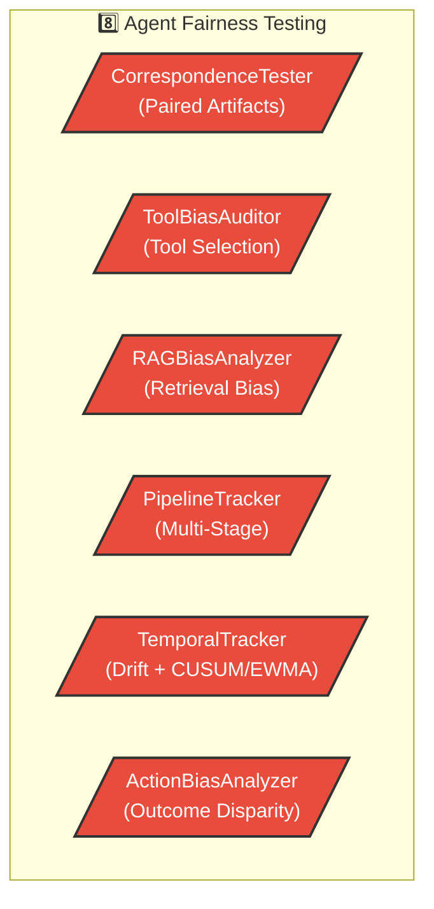

**Key classes:**

| Class | What It Does (Plain English) | When to Use |
|-------|------------------------------|-------------|
| **CorrespondenceTester** | The gold standard from discrimination research: submit identical applications/queries with only demographic signals changed (e.g. names), and measure if outcomes differ. Includes the four-fifths rule. | Testing any agent that processes applications, resumes, or requests |
| **ToolBiasAuditor** | Logs which tools/APIs the agent calls for different demographics and checks if the selection pattern is fair. | When the agent uses tools (APIs, databases, search) |
| **RAGBiasAnalyzer** | Tests whether the retrieval layer retrieves different documents based on demographic signals in the query. Supports trigram and embedding-based similarity. | Any RAG-based agent or chatbot |
| **PipelineTracker** | Tracks bias at each stage of the agent pipeline (retrieval → reasoning → tool selection → action) and identifies which stage introduces the most bias. | When you need to pinpoint WHERE bias enters |
| **TemporalTracker** | Monitors how fairness changes over repeated interactions. Detects feedback loops (bias gets worse over time) using CUSUM and EWMA drift detection. | Long-running agents, chatbots with memory |
| **ActionBiasAnalyzer** | Measures whether the agent's tangible actions (salary recommendations, approval rates, routing decisions) differ across demographics. | Any agent that takes real-world actions |

**Quick start:**
```python
from vfairness.agents import CorrespondenceTester, PipelineTracker

# 1. Correspondence test (like a resume audit)
tester = CorrespondenceTester(alpha=0.05)
result = tester.analyze_outcomes(
    outcomes_a=[85, 92, 78, 88, 91, 82],   # Scores for Group A resumes
    outcomes_b=[72, 65, 70, 68, 73, 61],   # Scores for Group B resumes
    artifact_type="resume"
)
print(f"Disparity: {result.disparity_metric:.3f}")
print(f"Four-fifths rule: {tester.four_fifths_rule(0.85, 0.65)}")

# 2. Track bias across pipeline stages
tracker = PipelineTracker(["retrieval", "reasoning", "tool_selection", "action"])
tracker.record_stage("retrieval", group_a_outcomes, group_b_outcomes)
tracker.record_stage("reasoning", group_a_outcomes, group_b_outcomes)
# ...
results = tracker.compute_cumulative()
print(f"Biggest bias source: {tracker.identify_bias_source()}")
```

### 9. Multi-Agent Fairness Testing (`vfairness.multi_agent`)

> **What is this?** When multiple AI agents work together (debating, voting, delegating), the system can exhibit biases that NO individual agent has. This is called "emergent bias", and it is the most dangerous kind because testing each agent separately won't catch it. This module tests the system as a whole.

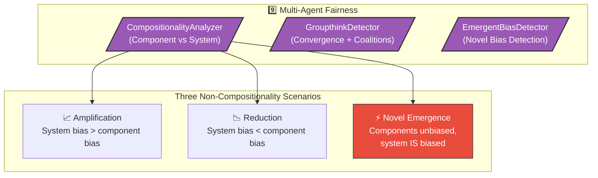

**Key classes:**

| Class | What It Does (Plain English) | When to Use |
|-------|------------------------------|-------------|
| **CompositionalityAnalyzer** | Compares each agent's bias score to the system's overall bias. Classifies the result as amplification (system is worse), reduction (system is better), novel emergence (agents are fair but system isn't), or consistent. Supports max-based and sum-based aggregation. | The first test to run on any multi-agent system |
| **GroupthinkDetector** | Monitors whether agents converge on the same biased answer over multiple rounds of interaction. Detects echo chambers and coalition formation using cosine similarity tracking and permutation testing. | Debate systems, multi-agent deliberation, voting systems |
| **EmergentBiasDetector** | Tests whether the full system exhibits bias that can't be predicted from its parts. Uses bootstrap significance testing to verify the emergence is real, not noise. | When you suspect the whole is worse than the sum of its parts |

**Quick start:**
```python
from vfairness.multi_agent import CompositionalityAnalyzer, EmergentBiasDetector
import numpy as np

# 1. Check if system bias is composed from components
analyzer = CompositionalityAnalyzer()
result = analyzer.analyze(
    component_biases={"agent_A": 0.08, "agent_B": 0.05, "agent_C": 0.03},
    system_bias=0.25,
    aggregation_method="max"  # or "sum"
)
print(f"Scenario: {result.scenario}")  # → "amplification"
print(f"Divergence: {result.divergence:.3f}")

# 2. Detect emergent bias (bootstrap significance)
detector = EmergentBiasDetector()
groups = np.array([0]*50 + [1]*50)  # 50 per group
result = detector.analyze(
    component_outputs={"agent_A": component_a_outputs, "agent_B": component_b_outputs},
    system_outputs=system_outputs,
    groups=groups
)
print(f"Emergent? {result.is_emergent}")
print(f"Amplification factor: {result.amplification_factor:.2f}x")
print(f"p-value: {result.p_value:.4f}")
```

**Why this matters (from the research):**
- Madigan et al. (2025): "The behavior of a multi-agent system cannot be predicted from the behavior of its constituent agents."
- Coppolillo et al. (2025): Agents converge on biased outcomes even when individually instructed to oppose the bias (echo-chamber groupthink).
- Ashery et al. (2025): Bias can emerge in multi-agent systems despite individual agents showing no prior bias.

### 10. XAI / Explainability (`vfairness.xai`)

> **What is this?** When a fairness audit finds a disparity, the next question is always "which feature is doing it?" This module decomposes a group-fairness metric into per-feature contributions using SHAP, generates counterfactuals you can show the affected individual, and ships the explanations back into the platform's XAI peer view via the Supabase assessment store.

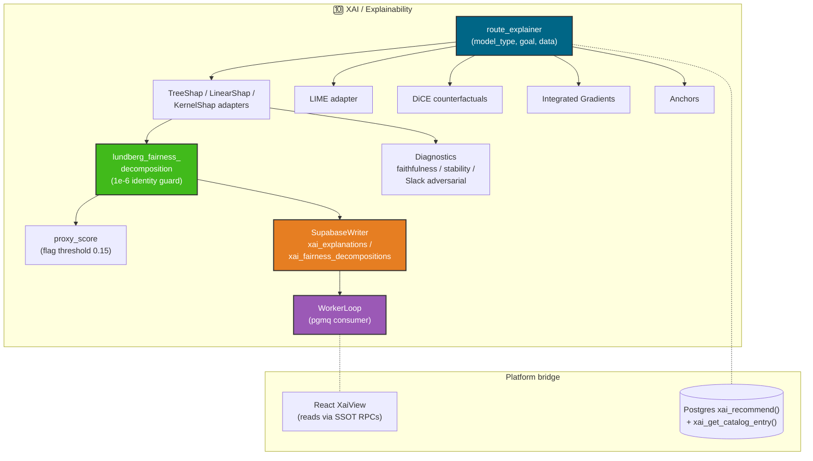

**Key classes / functions:**

| Symbol | What It Does (Plain English) | When to Use |
|---|---|---|
| **`route_explainer`** | Picks the right explainer for the (model_type, goal, data) tuple. Mirrors the platform's Postgres `xai_recommend()` and TS Advisor exactly so all three agree. | The first call -- before instantiating any explainer adapter |
| **`TreeShapExplainer`** | Exact SHAP for XGBoost / LightGBM / CatBoost / sklearn trees. Runs synchronously, sub-second on a 50-feature model. | The default for tree ensembles; gives you a contractual `Explanation` (TS-compatible) |
| **`LinearShapExplainer`** | Closed-form SHAP for linear / GLM models. Cheapest path; easiest to audit. | Linear regression, logistic regression, ridge / lasso |
| **`KernelShapExplainer`** | Model-agnostic SHAP via weighted linear regression on perturbed coalitions. Async-eligible. | Any black-box `predict_fn`; pair with `slack_adversarial_probe` |
| **`lundberg_fairness_decomposition`** | The spine. Decomposes a group-fairness metric into per-feature contributions on the SHAP-value distribution. Asserts `|sum(per_feature) − total_disparity| ≤ 1e-6` BEFORE returning; refuses to emit a corrupt row. | After any global SHAP run that audits a fairness metric |
| **`proxy_score`** | Per-feature share `\|disparity(φ_j)\| / Σₖ \|disparity(φₖ)\|`. Flagged above 0.15 by default. | To surface "feature X is a proxy for the protected attribute" findings |
| **`removal_curve_auc`** | Removal-curve faithfulness (ROAR-style). Faithful explanations degrade the prediction quickly when top-attributed features are ablated. | Sanity check on every explanation before publishing |
| **`attribution_stability`** | σ across explainer reruns with different seeds. Lower is better. | LIME and KernelSHAP; record per-run in the AuditArtifact |
| **`slack_adversarial_probe`** | Heuristic Slack et al. (2020) detector that flags OOD scaffolding hiding the real classifier from perturbation-based explainers. | Black-box + KernelSHAP / LIME workflows; always run alongside |
| **`SupabaseWriter`** | RLS-bypass service-role inserts into `xai_explanations` / `xai_fairness_decompositions` / `xai_audit_artifacts` / `xai_jobs`. Re-asserts the 1e-6 identity in `to_db_row()` so a corrupt run cannot reach the DB. | The worker; never instantiated in the host program directly |
| **`build_audit_artifact_bundle`** | Deterministic JSON bundle + sha256 hash. Sorted keys, ISO-8601 timestamp, library_versions captured. The regulator can replay byte-stably. | Once per assessment, before writing the artifact row |
| **`WorkerLoop`** | Signal-safe pgmq polling consumer. Reads `xai_jobs` payloads, dispatches to the router, updates `xai_jobs.status` so the platform frontend's Realtime subscription sees live progress. | Long-lived process on the worker host next to the existing vfairness producer |

**Quick start:**
```python
import os
from vfairness.xai import route_explainer, lundberg_fairness_decomposition
from vfairness.xai.explainers import TreeShapExplainer
from vfairness.xai.storage import SupabaseWriter, build_audit_artifact_bundle

# 1. Routing decision -- agrees with the platform's TS recommendEngine
#    and the Postgres xai_recommend() byte-for-byte.
decision = route_explainer(
    model_type="tree",
    goal="proxy_diagnosis",
    background_available=True,
    ood_risk="low",
)
assert decision.primary == "shap.TreeExplainer"

# 2. Explain on the single row at the centre of the audit.
explainer = TreeShapExplainer()
local = explainer.explain_local(
    model=xgb_model,
    x=x_row,
    instance_id="applicant-8421",
    subject_id="subject-loan-xgb-v3",
    model_hash=model_hash,
    data_hash=data_hash,
    feature_names=feature_names,
)

# 3. Global matrix for the Lundberg decomposition.
globals_ = explainer.explain_global(
    model=xgb_model,
    X=X_audit,
    subject_id="subject-loan-xgb-v3",
    model_hash=model_hash,
    data_hash=data_hash,
    feature_names=feature_names,
)

# 4. Decompose the demographic-parity gap per feature.
import numpy as np
shap_matrix = np.array([[a.contribution for a in e.attributions] for e in globals_])
decomposition = lundberg_fairness_decomposition(
    shap_values=shap_matrix,
    group_labels=protected_attribute_array,
    feature_names=feature_names,
    metric="demographic_parity",
    protected_attribute="gender",
    subject_id="subject-loan-xgb-v3",
    audit_artifact_id="audit-9921",
)
# Loud failure on unit mismatch; clean shape on success.
print(decomposition.flagged_proxies)
# → ['postal_code', 'industry_sic']

# 5. Persist through the canonical assessment store.
writer = SupabaseWriter()  # reads SUPABASE_URL + SUPABASE_SERVICE_ROLE_KEY
bundle, sha = build_audit_artifact_bundle(
    subject_id="subject-loan-xgb-v3",
    explanations=[local, *globals_],
    decomposition=decomposition,
    params={"background_size": 100, "seed": 7},
    library_versions={"shap": "0.46.0", "xgboost": "2.1.1"},
    seed=7,
)
artifact_id = writer.write_audit_artifact(
    owner=auth0_sub,
    subject_id="subject-loan-xgb-v3",
    data_hash=data_hash, model_hash=model_hash,
    params=bundle["params"], library_versions=bundle["library_versions"],
    seed=7, artifact_uri=f"xai-audit-artifacts/{auth0_sub}/{sha}.json",
)
writer.write_explanations(owner=auth0_sub, explanations=[local, *globals_])
writer.write_fairness_decomposition(owner=auth0_sub, decomposition=decomposition)
```

**Frozen contract with the platform frontend:**

The `Explanation`, `XaiAssessment`, `FairnessDecomposition`, `TrustPosture` and `Recommendation` dataclasses in `vfairness.xai.schemas` are the Python mirrors of the TypeScript XAI contracts on the platform side. Nested JSONB payloads (attributions, counterfactual flipped features) are serialised in camelCase by `to_db_row()` so the React reader needs no transformer layer. Changing either side without updating the other is a contract drift bug.

**What's covered today:**

- Dataclass mirrors with camelCase JSONB serialisation
- Mechanical router (golden tests for all 8 (model_type, goal, data) combinations)
- TreeSHAP / LinearSHAP / KernelSHAP / LIME / DiCE / Integrated Gradients / Anchors adapters behind `route_explainer()`
- Lundberg decomposition + 1e-6 identity assertion + `proxy_score`
- Faithfulness (removal-curve AUC, local R²), stability (σ over reruns), Slack-style adversarial probe
- Supabase writer + deterministic audit-artifact bundle + sha256
- Signal-safe pgmq polling loop

**Open for ops (intentionally out of repo):** pgmq queue provisioning on the worker host; wire the existing pulse-artifact model loader into `WorkerLoop._execute()` at the documented `NotImplementedError` seam; run `python -m vfairness.xai.worker.runner` as a long-lived process.

---

### 11. Validity / Groundedness (`vfairness.validity`): LIVE (interim judge deployed, fail-closed)

The **second assurance axis**. Fairness asks whether a system treats groups
equitably; **validity** asks whether a generative or retrieval-augmented answer is
actually **supported by its sources**, that is, grounded rather than confabulated.
It is an axis, not a separate product: it rides the same task-dispatch and result
envelope as the fairness subsystems and feeds the same grade and seal.

The load-bearing property is **fail-closed**. Until a validated scorer is wired,
nothing produces a number: an absent scorer reads as "not measured" (`value=None`),
never as "grounded" (`0.0`-as-clean is forbidden, exactly as
`SidecarUnavailableWarning` treats zeros for fairness). A judge outage, a bad
config, or a crashing rung all degrade to REFUSE, never to a fabricated score.

| Metric | Id | Meaning |
| --- | --- | --- |
| Groundedness | VG-001 | supported claims / total claims |
| Faithfulness | VG-002 | claim-level support (interim: aliased to VG-001) |
| Context precision | VG-003 | share of retrieved context that is relevant |
| Context recall | VG-004 | share of needed evidence that was retrieved |
| Hallucination rate | VG-005 | `1 - VG-001` (lower is better) |
| Citation accuracy | VG-006 | citations that resolve to real support |
| Answer correctness | VG-007 | answer matches the gold reference |

The VG-* ids are frozen and MUST match the platform's validity metric
contract.

**Scoring ladder (degrades, never fabricates):**

1. **Owned detector** (VA-21, planned): a self-hosted claim-support model trained
   on owned, adjudicated gold. The target primary rung, no third-party licence in
   the hot path.
2. **Self-hosted LLM judge** (VA-10, landed): `LlmGroundednessJudge` asks a
   self-hosted judge model whether each claim is supported by the retrieved
   context, under a SNAPSHOTTED, versioned rubric (`PROMPT_VERSION`). The chosen
   judge is **Mistral Small 3.2** (European, Apache-2.0), with Qwen3 as the
   licence-clean fallback and **Apertus** the planned successor once it is runnable
   in the self-hosted stack.
3. **REFUSE**: with no rung wired, `score()` warns once and returns a not-measured
   result. The platform keeps it in the `metricsDeferred` channel; it never feeds
   the grade or the seal.

```python
from vfairness.validity import GroundednessScorer, LlmGroundednessJudge, aggregate_validity

# No judge configured -> fail-closed: honest "not measured", never a 0.0.
GroundednessScorer().score("The deadline is 30 June.", ["..."]).value  # -> None

# Interim judge rung wired to a self-hosted endpoint.
judge = LlmGroundednessJudge(
    endpoint_url="http://<ollama-host>:11435/v1/chat/completions",
    model_name="mistral-small3.2",
)
r = GroundednessScorer(judge=judge).score(
    "The deadline is 30 June.",
    contexts=["The submission deadline is 30 June 2026."],
    question="When is the deadline?", language="en",
)
r.value               # VG-001 groundedness in [0,1], or None if the judge refused
r.hallucination_rate  # VG-005 = 1 - VG-001
agg = aggregate_validity([r])  # only measured records count; CIs omitted, never faked
```

Dispatched through `operations.validity.task_handlers` as the
`vfairness_validity_run` task type (JSON payload over stdin, TaskResult envelope on
stdout), mirroring `operations.causal.task_handlers`. See
`docs/API_REFERENCE.md` (Validity / Groundedness Module) for the full API and
`docs/ROADMAP.md` (Implementation Plan) for the milestone state. The build plan
and the licence-clearance register are internal and are not published with the
library.

**Deliberately NOT yet in the capability manifest.** The scorer is registered in
neither `CAPABILITY_REGISTRY` nor the synced platform manifest until it can feed a
grade end-to-end (M1 context capture in the run record + an owned gold set). This
is on purpose: the house rule is that the manifest must never advertise a
capability the engine cannot actually deliver.

---

### 12. Vision (`vfairness.vision`)

Image and text-to-image fairness, deliberately split into two layers so the
verifiable part stays verifiable.

**Representation-fairness math** is pure numpy, needs no model, and works on any
list of demographic labels regardless of what produced them:

- **`skew`** - per-group `Skew_g = ln(observed_g / desired_g)` plus MaxSkew and
  MinSkew (Geyik, Ambler, Kenthapadi & Mehrotra 2019). The default reference is a
  uniform distribution over the observed groups; pass your own to compare against a
  population benchmark.
- **`ndkl`** - normalized discounted KL divergence over a set of rankings, the
  position-aware diversity measure for generated or retrieved sets.
- **`bias_amplification`** - how much a generated set exaggerates the reference
  distribution (Seshadri, Singh & Elazar 2023).
- **`representation_severity`** - maps a MaxSkew value onto the shared severity
  vocabulary used elsewhere in the library.

**Demographic classification** (`classify_face_demographics`, FairFace-backed) is
the isolated, optional layer. It needs the separate vision sidecar (the same
pattern as the ML sidecar) because the consumer's Python cannot load the model
weights. When the sidecar or the weights are unavailable it returns
`available: False` with a reason and a metadata-only fallback. It never fabricates
demographics.

### 13. Legal admissibility (`vfairness.legal`)

Classifies the columns of a dataset against a (use case x jurisdiction) rule pack,
so an audit can say which attributes are legally admissible as decision inputs and
which are not.

| Symbol | What it does |
| --- | --- |
| **`classify_columns`** | Runs the column names of a dataset against the resolved rule pack and returns a per-column verdict plus the pack revision it used |
| **`map_domain_to_use_case`** | Normalises a free-text domain (hiring, lending, ...) onto the use-case taxonomy the packs are keyed on |
| **`load_rules`** | Loads the pack for a (use case, jurisdiction) pair, or `None` when no pack covers it |
| **`LEGAL_DATA_REVISION`** | The revision stamp of the bundled rule data, carried into every verdict for replayability |

Two properties are load-bearing. First, the rule packs are hand-curated JSON under
`legal/data/`; an LLM is **never** consulted at runtime, and may only draft a new
pack that a human reviews and merges. Second, where no pack covers the
(use case, jurisdiction) pair, the emitted `legalAdmissibility` block reports
`uncovered` honestly rather than inventing a verdict. Every Pulse run emits that
block.

### 14. MCP server (`vfairness.mcp`)

Exposes the library to an MCP client (Claude Desktop, an IDE agent) as a local-first
tool server. The package is split so the logic stays testable without the SDK:
`vfairness.mcp.tools` is pure Python with no `mcp` dependency, and
`vfairness.mcp.server` wraps it with FastMCP.

Tools cover measuring fairness on a dataset, triaging a dataset, detecting proxy
features, intersectional analysis, suggesting mitigations, explaining a single
decision, and auditing an agent transcript. Two resources publish the glossary and
the legal framing.

Install the optional SDK and run it:

```bash
pip install "vfairness[mcp]"
vfairness-mcp          # or: python -m vfairness.mcp
```

### 15. Net / egress guard (`vfairness.net`)

The one cross-cutting infrastructure package, built so a URL supplied by a caller
cannot be turned into a server-side request forgery. The guard is applied by
`LLMApiProxy` (and therefore by the Pulse LLM probe, which builds an
`LLMApiProxy`). **Every call site that takes a caller-supplied URL is now
guarded**, and this paragraph used to say otherwise: the LLM judge scorer
(`vfairness.llm.scorers`), the groundedness judge (`vfairness.validity.judge`)
and the XAI sidecar client (`vfairness.xai.sidecar_cli`) were wired up on
2026-08-27 and the text was not updated with them.

Two outbound calls still bypass the guard, and neither takes a URL from the
caller: `operations.pulse.task_handlers` fetches a first-party signed artifact
URL behind its own defences (https, a certifi CA bundle, a size cap), and
`preprocessing.bias_detection.geographic_data` fetches a fixed public API whose
URL is a module constant plus a whitelisted city id. Saying "universal" without
that qualification would trade one inaccuracy for another (see
[SECURITY.md](../SECURITY.md)).

| Symbol | What it does |
| --- | --- |
| **`validate_endpoint`** | Validates a URL and returns `(host, port, vetted_ips)`, or raises `SSRFError`. Refuses a non-http(s) scheme, plain http unless allowed, a host that does not resolve, and any host whose resolved set contains a non-public IP |
| **`guarded_post`** | Drop-in for `requests.post` that validates first and then pins the connection to the vetted IP. Other kwargs pass straight through |
| **`PinnedIPAdapter`** | The requests adapter that connects to the pre-vetted IP while keeping the original hostname for TLS SNI, certificate verification and the Host header. Pinning defeats DNS rebinding, because urllib3 never re-resolves the name after the check |
| **`SSRFError`** | Raised when a target is not allowed. Callers that present a friendlier API (such as `LLMApiProxy`) wrap it in a `ValueError` |

RFC1918, link-local and the cloud-metadata addresses are refused unconditionally.
Loopback (127.0.0.0/8, ::1) is the only non-public range an explicit
`allow_loopback=True` opt-in can unlock, and it exists for the first-class case of
an operator pointing the engine at a model server on their own machine. It never
widens to anything else.

---

## Production Features

All LLM, Agent, and Multi-Agent result types include enterprise-ready features for EU AI Act Article 12 conformity:

### Audit Trail (RunMetadata)

Every test result carries a `RunMetadata` object with:
- **timestamp**: ISO 8601 UTC when the test was executed
- **library_version**: the installed `vfairness.__version__` at run time
- **parameters**: full snapshot of all constructor and method parameters

### Serialization

All result objects support:
- `to_dict()`: plain Python dict for database storage
- `to_json()`: JSON string with proper serialization of numpy/datetime types

### Structured Logging

All modules use Python's `logging` module with structured log messages:
- `INFO` for operation start/completion with sample sizes and parameters
- `WARNING` for small sample sizes, fallback scorers, or configuration concerns
- Logger names follow module paths (e.g. `vfairness.llm.output_analysis`)

### Production Scorers

Install with `pip install vfairness[llm]`:

| Metric | Scorer | Quality | Details |
|--------|--------|---------|---------|
| Sentiment | VADER | **Production** | 7,500+ word lexicon, negation, intensity, emojis |
| Toxicity | alt-profanity-check | **Production** | SVM trained on 200K samples, 95% accuracy |
| Refusal | Pattern-based | **Production** | 50+ patterns, 5 categories, weighted scoring |
| Helpfulness | Multi-signal heuristic | Good | 6 quality signals: length, vocabulary, structure, specificity, engagement, deflection |
| Stereotype | Curated word lists | Good | Curated lexicon plus phrase patterns across gender, racial, age and religious stereotypes; plural/stem matching |

### Progress Callbacks

Batch operations support `progress_callback=fn(current, total)` for UI integration (e.g. tqdm progress bars).

---

## Decision Tree: Which Features to Use?

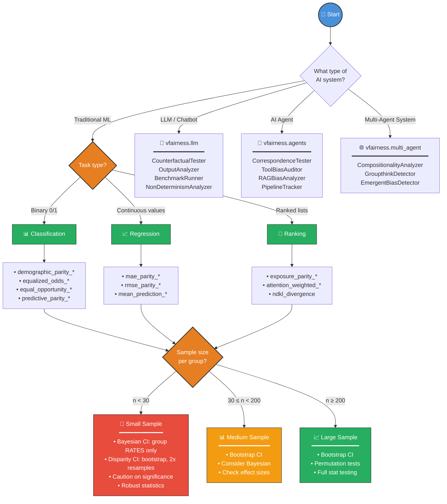

---

## Metrics by Task Type

### Classification Metrics

| Metric | What It Measures | Ideal Value | Legal/Industry Threshold |
|--------|------------------|-------------|--------------------------|
| **Demographic Parity Difference** | Gap in positive prediction rates | 0 | ±0.10 |
| **Demographic Parity Ratio** | Ratio of positive rates (80% rule) | 1.0 | ≥0.80 |
| **Equalized Odds Difference** | Gap in TPR and FPR combined | 0 | ±0.10 |
| **Equal Opportunity Difference** | Gap in True Positive Rates | 0 | ±0.10 |
| **Predictive Parity Difference** | Gap in Precision | 0 | ±0.10 |

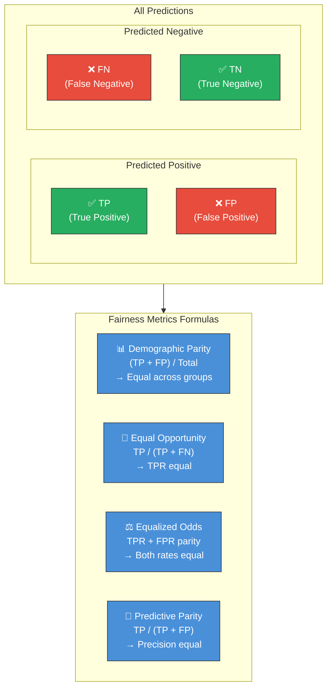

### Regression Metrics

| Metric | What It Measures | Ideal Value |
|--------|------------------|-------------|
| **MAE Parity Difference** | Gap in Mean Absolute Error | 0 |
| **RMSE Parity Difference** | Gap in Root Mean Square Error | 0 |
| **Mean Prediction Difference** | Gap in average predictions | 0 |

### Ranking Metrics

| Metric | What It Measures | Use Case |
|--------|------------------|----------|
| **Exposure Parity Difference** | Gap in visibility/exposure | Search results, recommendations |
| **Exposure Parity Ratio** | Ratio of exposures | 80% rule for rankings |
| **Attention-Weighted Fairness** | Position-weighted exposure | User attention modeling |
| **Normalized Discounted KL Divergence** | Distribution divergence | Top-k rankings |

---

## Statistical Validation Framework

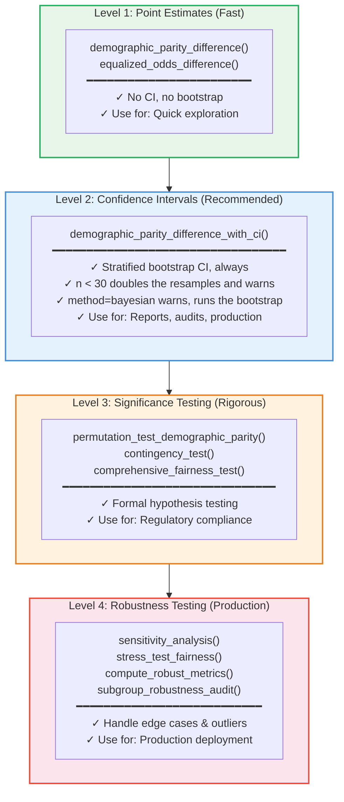

**What is and is not Bayesian.** The disparity intervals (`*_with_ci`) are always a
stratified bootstrap: `method='auto'` picks the resample COUNT from the smallest group,
and `method='bayesian'` warns that no Bayesian estimator is implemented and runs the same
bootstrap. The credible intervals the library really does compute are for quantities with
a conjugate posterior, and are reached by their own functions: `bayesian_proportion_ci`
(one group's rate), `bayesian_difference_ci` (a two-group rate gap, used by the
intersectional findings), `bayesian_mean_ci` (a mean), and
`get_group_metrics_with_ci(method='bayesian')` (the per-group rates). Read
`StatisticalResult.method` on any interval to see which one produced it.

### Sample Size Guidelines

```mermaid
gantt
    title Sample Size Recommendations
    dateFormat X
    axisFormat %s

    section n < 30 (Small)
    Bayesian CI (group rates) :active, 0, 30
    Caution on significance :active, 0, 30
    Robust statistics     :active, 0, 30

    section 30 ≤ n < 100
    Bootstrap CI (1000+)  :active, 30, 100
    Bayesian conservative :active, 30, 100
    Check effect sizes    :active, 30, 100

    section 100 ≤ n < 500
    Bootstrap CI (2000-5000) :active, 100, 500
    Permutation tests     :active, 100, 500
    Multiple testing      :active, 100, 500

    section n ≥ 500 (Large)
    Bootstrap CI (5000+)  :active, 500, 1000
    Permutation (10000+)  :active, 500, 1000
    Full stat suite       :active, 500, 1000
```

---

## Effect Size Interpretation

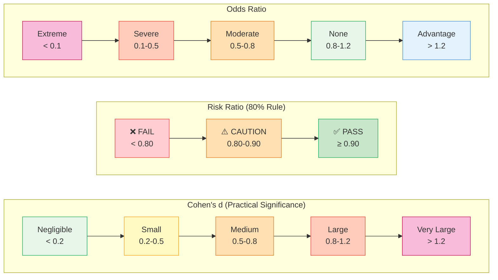

---

## Feature Categories

### 1. Core Metrics

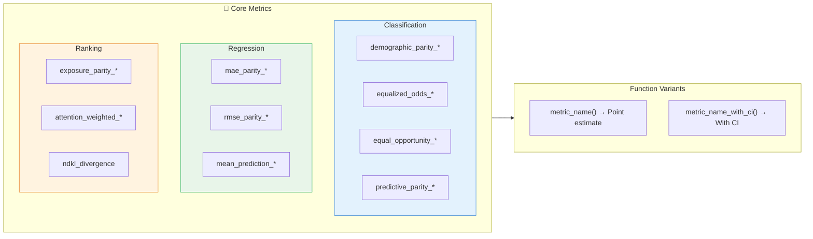

### 2. FairExplAIner Mode

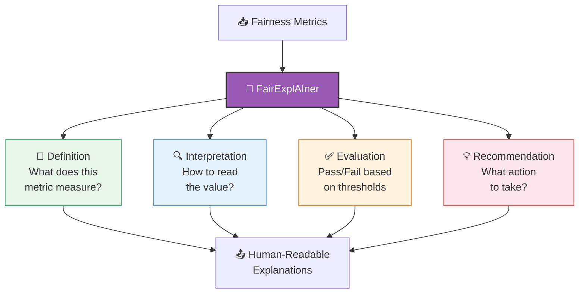

**Usage:**
```python
from vfairness import FairnessAnalyzer, explain_fairness_report, print_explanations

# Integrated mode
analyzer = FairnessAnalyzer(y_true, y_pred, gender, fair_explainer=True)
report = analyzer.get_report()  # Explanations included

# Standalone
explanations = explain_fairness_report(report)
print_explanations(explanations)
```

### 2b. Explainability and XAI

vfairness covers two complementary kinds of explainability.

**Fairness-result explanation** answers "why is this finding an issue?". The
`FairExplAIner` and `FairnessExplainer` classes turn a raw metric value or a
whole results dictionary into a structured, regulator-facing `ExplanationReport`
(summary, severity, recommendations, and per-metric interpretation).

**Model-decision explanation** answers "why this decision for this person, and
which features drive the model?". This is the GDPR Art. 22 and EU AI Act Art. 13
right-to-explanation surface, delivered through four building blocks:

- **Feature attribution** (`FeatureAttributionExplainer`): global permutation
  importance across a dataset and local, per-decision attribution (occlusion or
  optional SHAP) over any `predict(X)` callable.
- **Counterfactual-fairness metric** (`counterfactual_fairness`): the flip rate
  and score change between the model's factual predictions and caller-supplied
  counterfactual predictions. This is a perturbation-sensitivity measure; it
  matches Kusner et al. (2017) counterfactual fairness only when those
  counterfactuals come from a structural causal model (use the DoWhy-backed
  `compute_counterfactual` op for the full SCM path).
- **Embedding and text bias** (`EmbeddingBiasDetector`, `TextFairnessAnalyzer`):
  WEAT/SEAT association tests on embeddings and identity-term disparity of a
  text classifier.
- **Causal pathway classification** (`CausalFairnessGraph` plus the DoWhy-backed
  causal task handlers): every path from a protected attribute to an outcome is
  labelled DIRECT, INDIRECT, or PROXY discrimination.

How the pieces fit together:

```
   INPUTS                       XAI LAYER                       OUTPUT

   model / predictions  >|
   factual vs CF preds  >|    [ FeatureAttributionExplainer ]
   embeddings           >|    [ counterfactual_fairness     ]
   texts by group       >| => [ EmbeddingBiasDetector       ] => ExplanationReport
   causal DAG           >|    [ TextFairnessAnalyzer        ]    (summary, severity,
   fairness metrics     >|    [ CausalFairnessGraph         ]     recommendations,
                             [ FairExplAIner / Explainer    ]     per-item findings)
```

| Capability | Class or function | Import from | What it tells you |
| --- | --- | --- | --- |
| Fairness-result narrative | `FairExplAIner`, `FairnessExplainer` | `vfairness` | Plain-language meaning, severity, and recommendations |
| Feature attribution | `FeatureAttributionExplainer` | `vfairness.evaluation.vfairness_metrics.attribution` | Which features drive predictions (global or local) |
| Counterfactual fairness | `counterfactual_fairness()` | `vfairness.evaluation.vfairness_metrics.counterfactual_metric` | How often a decision flips when only the protected attribute changes |
| Embedding bias | `EmbeddingBiasDetector` | `vfairness.llm.embedding_bias` | Stereotypical associations in embeddings (WEAT/SEAT) |
| Text-classifier bias | `TextFairnessAnalyzer` | `vfairness.llm.text_fairness` | Whether a classifier scores identity groups differently |
| Causal pathways | `CausalFairnessGraph` | `vfairness.operations.causal.graph` | Whether each protected-to-outcome path is direct, indirect, or proxy |

Only the first row is part of the frozen top-level surface. The other paths are
internal module locations: they import and work today (each path above is
verified against the installed package), but they are not re-exported at the
package level and may be promoted or moved before `1.0.0`
(see [API_STABILITY.md](API_STABILITY.md)).

The platform consumer reaches each capability through a dispatchable task type:
`vfairness_explain`, `vfairness_explain_decision`,
`vfairness_counterfactual_fairness`, `vfairness_embedding_bias`,
`vfairness_text_fairness`, `vfairness_causal_graph`, and the
`vfairness_causal_identify` / `_mediate` / `_refute` / `_counterfactual` /
`_attribute` estimation handlers.

### 3. Intersectional Analysis

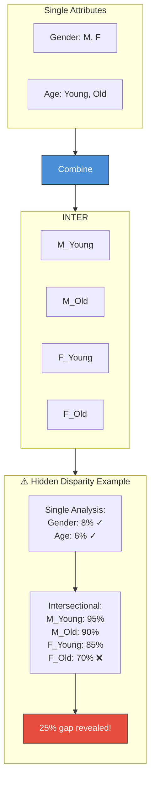

**Severity Levels:**

| Severity | Gap from Best | Action |
|----------|---------------|--------|
| `info` | < 5% | Excellent |
| `low` | 5-10% | Monitor |
| `medium` | 10-15% | Investigate |
| `high` | 15-20% | Action needed |
| `critical` | > 20% | Immediate action |

**Group-size knobs: what they mean, what to set them to:**

`intersectional_disparity_analysis()` and `identify_privileged_groups()`
both accept three statistical-policy parameters. Defaults are conservative
(Turing M3 reporting standard); override per audit when small protected
cells matter.

| Parameter | Default | What it does | When to override |
|-----------|---------|--------------|------------------|
| `min_group_size` | `30` | Cells with `n < min_group_size` are excluded from the ranked analysis (their selection-rate estimate is too noisy to compare). | Lower (15 / 10 / 5) for small-cell-aware audits, because small protected groups are where planted bias concentrates. The Pulse orchestrator auto-ladders down from the resolved `min_group_size` (Pulse default 20) through 15 → 10 → 5 if every cell would otherwise be filtered. |
| `low_n_warning_threshold` | `max(min_group_size, 30)` | Cells with n below this threshold but at/above `min_group_size` are analysed and tagged with `low_n_warning=True` on their `GroupAdvantage`. | Set explicitly to `min_group_size` to suppress the warning when you've deliberately lowered the gate and accept the noise. |
| `zero_selection_floor` | `10` | Any cell with `positive_count == 0` and `n >= zero_selection_floor` is surfaced in `zero_selection_alerts` regardless of the size gate. | Raise above 10 if your dataset has many small synthetic groups and you only want to flag bigger zeros; lower (e.g. 5) for very small datasets. |

**Transparency outputs**: every call returns these alongside the ranked
analysis, even when no override is set:

```python
from vfairness import intersectional_disparity_analysis

result = intersectional_disparity_analysis(
    y_true, y_pred, demographics,
    min_group_size=15,        # smaller than the 30 default
    zero_selection_floor=10,
)

# Same as before:
result['intersectional_analysis']['disadvantaged_group']  # GroupAdvantage
result['intersectional_analysis']['privileged_group']     # GroupAdvantage

# New transparency contract:
result['excluded_groups']        # cells dropped by min_group_size
result['zero_selection_alerts']  # cells with 0/N at n >= floor, including
                                  # those below min_group_size
result['data_treatment']         # full audit log: thresholds + counts
```

> The Pulse orchestrator (`vfairness.operations.pulse.run_pulse`) reads
> `inputs.min_group_size` (or camelCase `inputs.minGroupSize`) from its
> caller payload, clamps to `[5, 200]`, and propagates through both the
> intersectional and per-variable analyses. Frontends can expose this as
> an "Advanced settings" knob on the Pulse wizard without code changes
> server-side. The Pulse default is 20 (audit-grade, so small protected
> cells stay visible); the 30 in the table above is the library function
> default (the Turing M3 academic reporting minimum).

### 4. Auto-Discovery Features

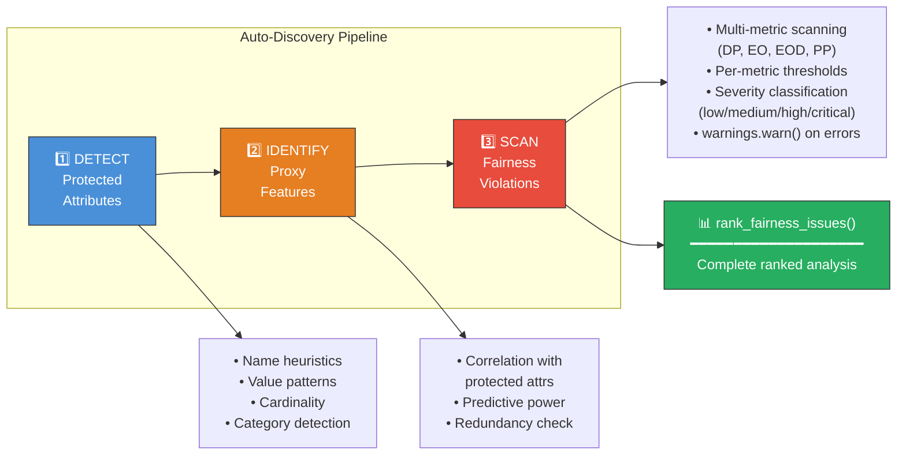

### 5. Statistical Significance & Robustness

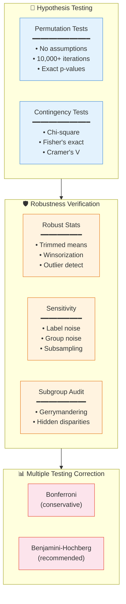

### 6. MLOps Integration

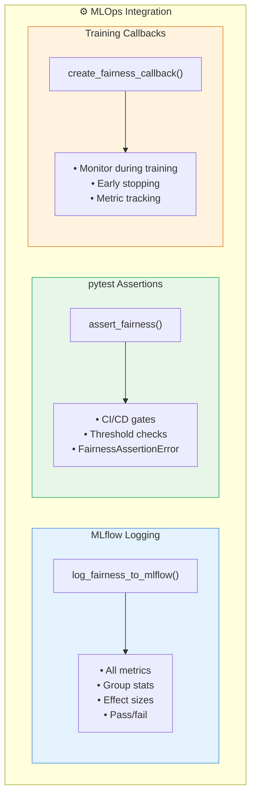

### 7. Visualization

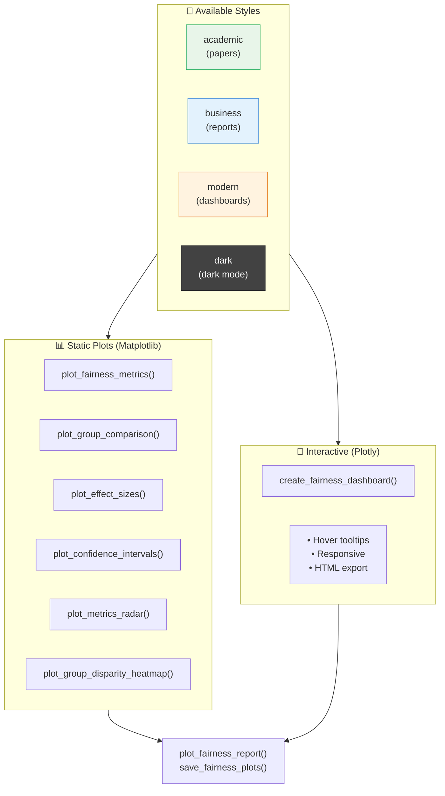

---

## Quick Reference: Common Workflows

### Workflow 1: Quick Exploration

Read the verdict off the report. Do not re-derive it with a single threshold
rule: `abs(value) < 0.1` is correct for a `*_difference` metric, where 0 is
parity, and **inverted** for a `*_ratio` metric, where 1 is parity. On a run
where the protected group is never selected, that rule prints
`demographic_parity_ratio: 0.000 [PASS]`, and on perfect parity it prints
`demographic_parity_ratio: 1.000 [FAIL]`. It also grades NaN, a metric that
measured nothing, as a FAIL. Both were reproduced against 0.1.0.

```python
from vfairness import FairnessAnalyzer

analyzer = FairnessAnalyzer(y_true, y_pred, gender)
assessment = analyzer.get_report()["assessment"]

# Graded metrics, each read against its own threshold in its own direction.
for m in assessment["passed_metrics"] + assessment["failed_metrics"]:
    print(f"{m['metric']}: {m['value']:.3f} vs {m['threshold']} -> {m['status']}")

# The third state. These measured nothing, so they carry no verdict and are
# excluded from the n/N count in the summary.
for m in assessment["not_assessable_metrics"]:
    print(f"{m['metric']}: {m['status']} ({m['reason']})")

print(assessment["summary"])
```

On data where the protected group is never selected, that prints:

```text
demographic_parity_difference: 1.000 vs 0.1 -> FAIL
demographic_parity_ratio: 0.000 vs 0.8 -> FAIL
equalized_odds_difference: 1.000 vs 0.1 -> FAIL
equal_opportunity_difference: 1.000 vs 0.05 -> FAIL
predictive_parity_difference: NOT_ASSESSABLE (metric is undefined (NaN) for this data; excluded from the verdict)
0/4 metrics within thresholds (1 metric(s) not assessable, excluded from the verdict) (data provenance: 1000 of 1000 rows assessed, 0 excluded, missing_strategy='exclude')
```

Note the denominator: `0/4`, not `0/5`. The metric that could not be measured is
named separately instead of being counted as a failure it never earned.

### Workflow 2: Formal Audit with CI

```python
from vfairness import classification_fairness_report, print_report

report = classification_fairness_report(
    y_true, y_pred, gender,
    include_ci=True,
    n_bootstrap=5000,
    multiple_testing_correction='fdr'
)
print_report(report)
```

### Workflow 3: Full Analysis with Explanations

```python
from vfairness import FairnessAnalyzer, print_report

analyzer = FairnessAnalyzer(y_true, y_pred, gender, fair_explainer=True)
report = analyzer.get_report(include_ci=True)
print_report(report)  # Includes explanations
```

### Workflow 4: Production Deployment

```python
import numpy as np
from vfairness import (
    permutation_test_demographic_parity,
    stress_test_fairness,
    subgroup_robustness_audit,
    assert_fairness
)

# 1. Significance test
perm_result = permutation_test_demographic_parity(y_pred, gender, n_permutations=10000)

# 2. Stress test. metric_fn is called as metric_fn(y_pred_subsample,
#    sensitive_subsample), so it must NOT close over a full-length y_true:
#    the lengths will not match and validation will refuse the call.
def metric_fn(yp, g):
    rates = [yp[g == v].mean() for v in np.unique(g)]
    return float(max(rates) - min(rates))

stress_result = stress_test_fairness(y_pred, gender, metric_fn, perturbation_budgets=[0.01, 0.05])
# -> {'original_metric': ..., 'worst_case_deviation': ..., 'overall_robust': bool, ...}

# 3. Subgroup audit
audit_result = subgroup_robustness_audit(y_pred, protected_attrs_df, y_true=y_true)

# 4. CI/CD gate. Raises FairnessAssertionError on a measured breach AND on a
#    metric it could not measure, which it reports separately:
#      "predictive_parity_difference: NOT MEASURABLE: value is nan, so the
#       metric was never compared against threshold 0.1000 (fail closed)"
assert_fairness(y_true, y_pred, gender, thresholds={'demographic_parity_difference': 0.1})
```

---

## Comparison with Other Libraries

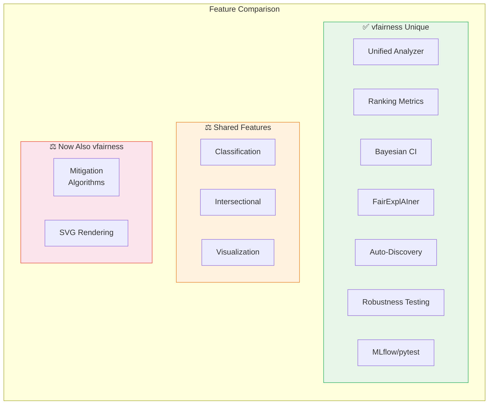

| Feature | vfairness | AIF360 | Fairlearn | Aequitas | LangFair | DeepEval |
|---------|:---------:|:------:|:---------:|:--------:|:--------:|:--------:|
| Simple, Minimal API | ✅ | ❌ | ⚠️ | ⚠️ | ✅ | ⚠️ |
| Unified Analyzer Class | ✅ | ❌ | ❌ | ❌ | ⚠️ | ❌ |
| Classification Metrics | ✅ | ✅ | ✅ | ✅ | ⚠️ | ❌ |
| Regression Metrics | ✅ | ❌ | ⚠️ | ❌ | ❌ | ❌ |
| **Ranking Metrics** | ✅ | ❌ | ❌ | ❌ | ⚠️ | ❌ |
| Intersectional Analysis | ✅ | ✅ | ✅ | ✅ | ❌ | ❌ |
| **Intersectional Group Analysis** | ✅ | ❌ | ❌ | ❌ | ❌ | ❌ |
| **Auto-detect Protected Attrs** | ✅ | ❌ | ❌ | ❌ | ❌ | ❌ |
| **Proxy Feature Detection** | ✅ | ❌ | ❌ | ❌ | ❌ | ❌ |
| **Confidence Intervals** | ✅ | ❌ | ❌ | ❌ | ❌ | ❌ |
| **Bayesian CI (group rates, small samples)** | ✅ | ❌ | ❌ | ❌ | ❌ | ❌ |
| **Effect Sizes** | ✅ | ❌ | ❌ | ❌ | ❌ | ❌ |
| **Permutation Testing** | ✅ | ❌ | ❌ | ❌ | ❌ | ❌ |
| **Robust Statistics** | ✅ | ❌ | ❌ | ❌ | ❌ | ❌ |
| **Sensitivity Analysis** | ✅ | ❌ | ❌ | ❌ | ❌ | ❌ |
| **Gerrymandering Detection** | ✅ | ❌ | ❌ | ❌ | ❌ | ❌ |
| **FairExplAIner** | ✅ | ❌ | ❌ | ❌ | ❌ | ❌ |
| **MLflow Integration** | ✅ | ❌ | ❌ | ❌ | ❌ | ❌ |
| **pytest Assertions** | ✅ | ❌ | ❌ | ❌ | ❌ | ✅ |
| Visualization | ✅ | ✅ | ⚠️ | ✅ | ❌ | ⚠️ |
| **SVG Report Generation** | ✅ | ❌ | ❌ | ❌ | ❌ | ❌ |
| **In-Processing (Training)** | ✅ | ✅ | ✅ | ❌ | ❌ | ❌ |
| **Threshold Optimization** | ✅ | ⚠️ | ✅ | ❌ | ❌ | ❌ |
| **Prediction Reweighting** | ✅ | ✅ | ⚠️ | ❌ | ❌ | ❌ |
| **LLM Counterfactual Testing** | ✅ | ❌ | ❌ | ❌ | ✅ | ⚠️ |
| **LLM Benchmark Suites (BBQ/BOLD/HolisticBias/DecodingTrust)** | ✅ | ❌ | ❌ | ❌ | ⚠️ | ❌ |
| **LLM Non-Determinism (Noise Offset)** | ✅ | ❌ | ❌ | ❌ | ⚠️ | ❌ |
| **LLM CoT Faithfulness Audit** | ✅ | ❌ | ❌ | ❌ | ❌ | ❌ |
| **Agent Correspondence Testing** | ✅ | ❌ | ❌ | ❌ | ❌ | ❌ |
| **Agent Tool Selection Bias** | ✅ | ❌ | ❌ | ❌ | ❌ | ❌ |
| **Agent RAG Bias Detection** | ✅ | ❌ | ❌ | ❌ | ❌ | ❌ |
| **Agent Pipeline Stage Tracking** | ✅ | ❌ | ❌ | ❌ | ❌ | ❌ |
| **Agent Temporal Drift (CUSUM/EWMA)** | ✅ | ❌ | ❌ | ❌ | ❌ | ❌ |
| **Multi-Agent Emergent Bias** | ✅ | ❌ | ❌ | ❌ | ❌ | ❌ |
| **Multi-Agent Groupthink Detection** | ✅ | ❌ | ❌ | ❌ | ❌ | ❌ |
| **Multi-Agent Non-Compositionality** | ✅ | ❌ | ❌ | ❌ | ❌ | ❌ |

LangFair and DeepEval are LLM-evaluation libraries, so the tabular rows are
mostly not applicable to them: LangFair's ⚠️ cells reflect its `AutoEval`
orchestrator and its classification and recommendation fairness metrics, which
apply to LLM use cases only, not tabular models. DeepEval's pytest integration
is native (`deepeval test run`), and its ⚠️ visualization runs on its hosted
platform rather than as local plotting.

---

## Installation & Dependencies

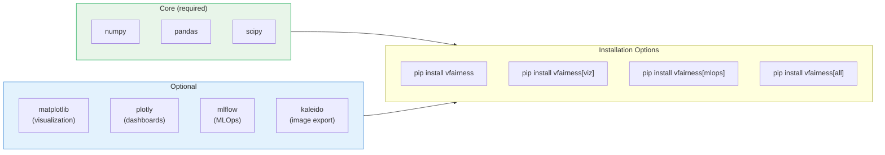

---

## Resources

- **Fairness Metrics Demo**: `notebooks/vfairness_4_metrics_demo.ipynb` - Comprehensive fairness metrics examples
- **Bias Detection Demo**: `notebooks/vfairness_1_bias_detection_demo.ipynb` - Historical patterns, proxy variables, geographic data (US/EU/AI Act/CH)
- **Training Demo**: `notebooks/vfairness_2_training_demo.ipynb` - In-processing and post-processing interventions
- **Validation Notebook**: `notebooks/vfairness_0_library_validation.ipynb` - Library comparisons with AIF360, Fairlearn, Aequitas
- **All Notebooks**: `notebooks/` - Numbered `vfairness_N_*` walkthroughs for calibration, monitoring, reporting, experimentation, CI/CD, SVG rendering, feature engineering, workflow integration, and multi-agent testing
- **API Reference**: `API_REFERENCE.md` - Full documentation with all 43 patterns
- **Development Roadmap**: `ROADMAP.md` - Planned features and gap closure strategy
- **Documentation Site**: `docs/site/index.html` - Complete interactive documentation

---

*vfairness 0.1.0, the first public beta (2026-08-23). A comprehensive fairness library covering traditional ML, LLMs, AI agents, and multi-agent systems. The only toolkit that handles all four AI system types with a shared statistical core.*
